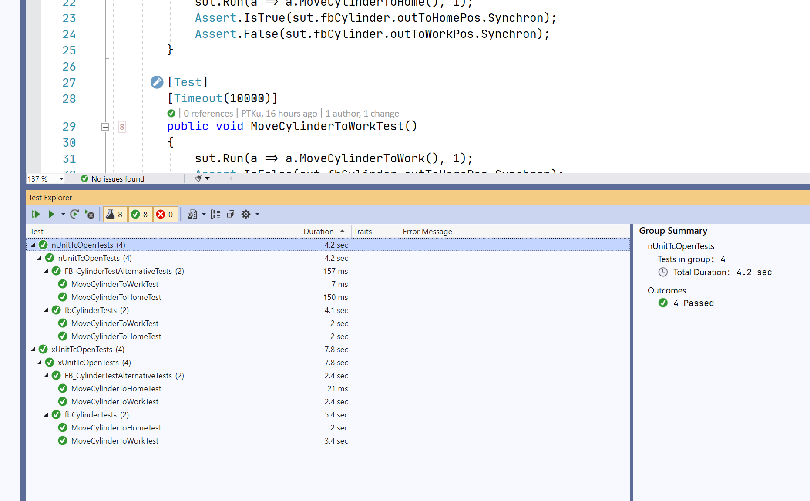

# Tc.Prober

*Tc.Prober* gives you the possibility to unit test your TwinCAT3 plc code using unit testing frameworks (such as NUnit, XUnit, etc.). It provides runners that execute plc code remotely and allow you to **arrange-act-assert in .net environment**. This approach brings the advantage of using well-evolved testing frameworks and tools in unit testing of the plc code.



## This project is using:

- TwinCAT3 4024.10
- VS2019
- nUnit/xUnit
- Inxton.Package.Vortex.Essentials

## Inxton.Vortex.Framework IVF

Takes you plc program and trans-piles it into .net accessible twin. Represented as clr/.net object that are accessible from any .net application. It is as if you referenced plc project in a .net project. You can read [more here](https://github.com/Inxton/documentation/blob/master/apis/Inxton.vortex.compiler.console/Conceptual/TwinObjects.md).

### TL;DR Inxton licensing*

Inxton developer license is free and grants full functionality. It limits the run of the program to a period of up to 2 hours. After this period, the restart is required. You can get the license at [inxton.com](www.inxton.com). For the purpose of unit testing project the developer license is sufficient.

## Brief concept description

### Rpc plc method

Any method with ```{attribute 'TcRpcEnable'}``` is trans-piled by the IVF as clr/.net method of its function block and makes it invocable from .net environment. **The methods ```return type``` and ```parameters``` must be of primitive type.**

*Example plc method*

~~~ Pascal
{attribute 'TcRpcEnable'}
METHOD RunCount : UINT
VAR_INPUT
	resetCounter : BOOL;
END_VAR
VAR_INST
	runs : UINT;	
END_VAR
-------------------------------------------------
IF(resetCounter) THEN runs := 0; RETURN; END_IF; 

runs := runs + 1;
RunCount := runs;
~~~

### .Net method

The method will be rendered available into .net by IVF compiler.

*Calling the method from C#*

~~~ C#
public ushort RunCount(System.Boolean resetCounter)
{ 
    return (ushort)Connector.InvokeRpc("Tests._basicRunnerTests", "RunCount", new object[]{resetCounter});
}
~~~

### Run test in nUnit

Unit testing

~~~ C#
[Test]
[TestCase((ushort)10)]
[TestCase((ushort)11)]
public void basic_runner_tests_run_count(ushort expected)
{
    //-- Arrange
    var sut = Entry.Plc.Tests._basicRunnerTests;
    sut.RunCount(true);

    //-- Act
    var actual = sut.Run((A) => A.RunCount(false), expected);

    //-- Assert
    Assert.AreEqual(expected, (ushort)actual);
}
~~~

## Test recording

The runner can be run in recording/replaying mode. This allows to record I/O image during testing with the hardware and to replay it later when the hardware is no longe available.

Testing with recording

~~~ C#
public void RecordAndReplayTest()
        {
            var sut = connector.Tests._recorderRunnerTests;
            IRecorder actor;

            // We run with recording

            //-- Arrange
            sut._recorder.counter.Synchron = 0;
            var count = 0;

            // Actor is recorder-graver
            actor = new Recorder.Recorder<stRecorder, PlainstRecorder>(sut._recorder, RecorderModeEnum.Graver).Actor;

            sut.Run(() => sut.RunWithRecorder(), // Actual testing method.
                    () =>
                    {                        
                        Assert.AreEqual(count++, sut._recorder.counter.Synchron);
                        sut._recorder.counter.Synchron++;        // this line changes the state of plc variable for simulation                       
                        return sut._recorder.counter.Synchron > 100;
                    },
                    null,
                    null,
                    actor,
                    Path.Combine(Runner.RecordingsShell, $"{nameof(RecordAndReplayTest)}.json")
                    );


            // We run the same code with re-play. 

            // Actor is player
            actor = new Recorder.Recorder<stRecorder, PlainstRecorder>(sut._recorder, RecorderModeEnum.Player).Actor;

            //-- Arrange
            sut._recorder.counter.Synchron = 0;
            count = 0;


            sut.Run(() => sut.RunWithRecorder(), // Actual testing method.
                   () =>
                   {
                       Assert.AreEqual(count++, sut._recorder.counter.Synchron);
                       // sut._recorder.counter.Synchron++;        // this line changes the state of plc variable for simulation commented out in replay.                      
                        return sut._recorder.counter.Synchron > 100;
                   },
                   null,
                   null,
                   actor,
                   Path.Combine(Runner.RecordingsShell, $"{nameof(RecordAndReplayTest)}.json")
                   );

        }
~~~

## Advantages

- Direct use of well evolved unit testing frameworks in plc code testing.
- Runners are in control of the cycle execution. It allows create assertion in single cycles.
- Ability to record the state of the plc structure for later reconstruction of hardware behavior. This is particularly useful when the hardware component are available for testing for limited time.

## Limitations

- The method is executed by runners and not plc task therefor it must be taken into consideration the interaction between hard-real-time and non-real-time, in particular when interacting with I/O systems. The units under tests should not be called from real-time, but the execution must be handled from non-real-time environment. I/O should be mirrored into data transfer variables/objects.
- Whenever the fast execution in order of ```us``` or low jitter is required, this approach would be is not suitable.
- When the execution is provided by test runners of breakpoints in plc program are not hit, however the state of plc program of can be observed.
